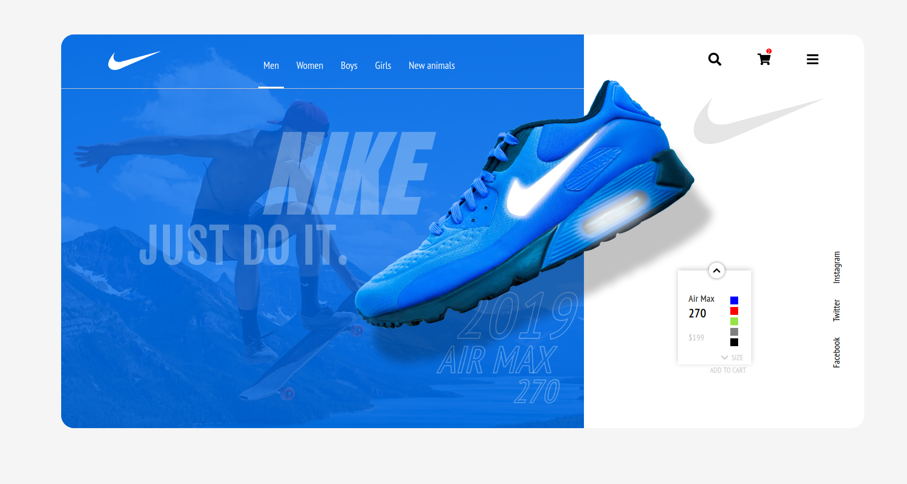

<h1 align="center">
  🐾 Clone da Homepage da Nike 
</h1>

  <a href="#rocket-tecnologias">Tecnologias</a>&nbsp;&nbsp;&nbsp;|&nbsp;&nbsp;&nbsp;
  <a href="#-projeto">Projeto</a>&nbsp;&nbsp;&nbsp;|&nbsp;&nbsp;&nbsp;
  <a href="#-layout">Desenvolvimento</a>&nbsp;&nbsp;&nbsp;|&nbsp;&nbsp;&nbsp;

 

  

## 📛 Tecnologias

- [React](https://reactjs.org)
- [Styled Components](https://styled-components.com/)

## 🏀 Projeto

O objetivo é clonar a homepage da Google